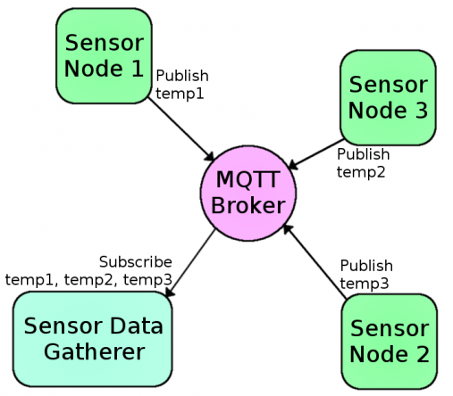

 MQ Telemetry Transport
==

## MQTT

> MQTT is a light-weight protocol used for Machine to Machine (M2M) communication. MQTT used a publish/subscribe message forwarding model built on top of TCP/IP protocol.

> MQTT is a machine-to-machine (M2M)/"Internet of Things" connectivity protocol. It was designed as an extremely lightweight publish/subscribe messaging transport. It is useful for connections with remote locations where a small code footprint is required and/or network bandwidth is at a premium.

- [MQTT Homepage](http://mqtt.org/)
- [MQTT Protocol Specification](http://www.ibm.com/developerworks/library/ws-mqtt/)
- [HiveMQ MQTT Essentials: Part 1 – Introducing MQTT](http://www.hivemq.com/blog/mqtt-essentials-part-1-introducing-mqtt)
- [HiveMQ MQTT Essentials Wrap-Up](http://www.hivemq.com/blog/mqtt-essentials-wrap-up)




### Features

Core Messages

- Connect
- Disconnect
- Publish
- Subscribe
- Unsubscribe

Quality of Services

- 0, 1, 2

[HiveMQ MQTT Essentials Part 6: Quality of Service 0, 1 & 2](http://www.hivemq.com/mqtt-essentials-part-6-mqtt-quality-of-service-levels/)

### Server Implementations

- IBM MQ
- IBM Microbroker
- RSMB
- Mosquitto
- MQTT.js
- Apache ActiveMQ
- RabbitMQ
- [Adafruit MQTT API](https://learn.adafruit.com/adafruit-io/mqtt-api)

### Clients

- C/C++/C#
- Java
- Perl
- Python
- PHP
- Rex
- Ruby
- Arduino

## Brokers

- https://www.cloudmqtt.com/
- http://test.mosquitto.org/
- [Eclipse MQTT)](http://iot.eclipse.org/getting-started#tutorials)

### Mosquitto

> Mosquitto is an open source (BSD licensed) message broker that implements the MQ Telemetry Transport protocol versions 3.1 and 3.1.1. MQTT provides a lightweight method of carrying out messaging using a publish/subscribe model.

>MQTT (a.k.a. mosquitto) is perfect for mobile and embedded devices because of its lightweight (in processing, memory management and bandwidth) messaging protocol. 

> For this protocol, notice that it lacks of encryption in its base, otherwise it would add an important overhead to the connection. Security at the application level requires a lot of work.

[Mosquitto Homepage](http://mosquitto.org/)

#### Mosquitto Intel® Edison Setup

- [Building and running Mosquitto MQTT on Intel Edison](https://software.intel.com/en-us/blogs/2015/02/20/building-and-running-mosquitto-mqtt-on-intel-edison)
- [Connecting Sensor Networks and Devices to the Cloud in just minutes: Solution Brief](https://software.intel.com/sites/default/files/managed/52/10/IBM_Connecting_Sensor_Networks_and_Devices_Cloud_Minutes_Rev1_2.pdf)

#### Mosquitto Intel® Galileo Setup

```sh
    root@galileo:~# wget http://mosquitto.org/files/source/mosquitto-1.3.5.tar.gz
    root@galileo:~# tar xvf mosquitto-1.3.5.tar.gz
    root@galileo:~# cd mosquitto-1.3.5
    root@galileo:~# make -j3 WITH_SRV=no
    root@galileo:~# adduser mosquitto
    root@galileo:~# cd test/broker
    root@galileo:~# make -j3 test
    root@galileo:~# cd ../../
    root@galileo:~# cp client/mosquitto_pub /usr/bin
    root@galileo:~# cp client/mosquitto_sub /usr/bin
    root@galileo:~# cp lib/libmosquitto.so.1 /usr/lib
    root@galileo:~# cp src/mosquitto /usr/bin
```

#### Mosquitto Applications

```sh
    root@platform:~# mosquitto
    root@platform:~# mosquitto_sub
    root@platform:~# mosquitto_pub
```

#### Mosquitto Demo Temperature Gauge

Go to http://test.mosquitto.org/gauge/ and execute

```sh
    root@platform:~# mosquitto_pub -h test.mosquitto.org -t temp/random -m 23.0
```
####  Mosquitto MQTT Server/Broker

As subscriber

```sh
    root@galileo:~# mosquitto_sub -h test.mosquitto.org -p 1883 -t workshop/galileo
    root@edison:~# mosquitto_sub -h test.mosquitto.org -p 1883 -t workshop/edison
```

As publisher

```sh
    root@galileo:~# mosquitto_pub -h test.mosquitto.org -p 1883 -t workshop/galileo -m "Hello Galileo Operators!"
    root@edison:~# mosquitto_pub -h test.mosquitto.org -p 1883 -t workshop/edison -m "Hello Edison Operators!"
```

As subscriber

```sh
    root@platform:~# mosquitto_sub -h test.mosquitto.org -p 1883 -t workshop/all
```

As publisher

```sh
    root@platform:~# mosquitto_pub -h test.mosquitto.org -p 1883 -t workshop/all -m "Hello All Operators!"
```

See output for the following command

```sh
    root@platform:~# mosquitto_sub -h test.mosquitto.org -t "#" -v
```
